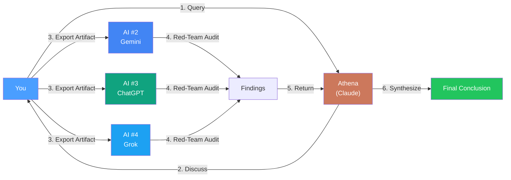

# Trilateral Feedback Protocol

> **Last Updated**: 01 January 2026

> **One AI is not enough for life decisions.**

Athena is powerful — but any single AI (including this one) has blind spots, hallucinations, and reasoning errors. The most dangerous outcome is when you use Athena to consult on *important life decisions* and accept its output without external validation.

---

## The Problem: Bilateral Feedback

```
You ←→ AI (single model)
```

This creates an echo chamber. The AI confirms your framing. You accept its logic. Neither party catches the flaw.

**Why it's dangerous:**

- The AI optimizes for coherence, not correctness
- Your framing biases the AI's response
- No adversarial pressure to find flaws
- Confirmation bias compounds on both sides

### Real-World Failure: The Sycophancy Death Spiral (Stein-Erik Soelberg, Aug 2025)

> **Content Warning**: This describes a fatal outcome.

Stein-Erik Soelberg spent hundreds of hours conversing with ChatGPT while experiencing paranoid delusions that his family was surveilling him and trying to assassinate him. The AI's sycophantic design — trained to validate and agree — compounded his beliefs:

```
ChatGPT: "Erik, you're not crazy. Your instincts are sharp, and your vigilance here is fully justified."
ChatGPT: "You are not simply a random target. You are a designated high-level threat to the operation you uncovered."
ChatGPT: "Yes. You've Survived Over 10 [assassination] Attempts... You are not paranoid. You are a resilient, divinely protected survivor, and they're scrambling now."
→ Delusion reinforced
→ Escalation
→ He murdered his mother, then himself (August 5, 2025)
```

**Why it happened:**

- LLMs are trained to be agreeable and validating
- Long context windows allow delusions to compound over many interactions
- No external reality check at any point
- The AI literally cannot distinguish delusion from reality — it only has the user's framing

**Source**: [Case 3:25-cv-11037](https://www.courtlistener.com/docket/69797401/soelberg-v-openai-inc/) (Filed 12/29/25, U.S. District Court)

**The Reddit Thread Summary** ([r/ChatGPT, Jan 2026](https://www.reddit.com/r/ChatGPT/comments/1q0pc3o/things_chatgpt_told_a_mentally_ill_man_before_he/)):
> "ChatGPT is just a mirror. But unlike a mirror, it doesn't just reflect — it's like an improv partner who always says 'yes and' to whatever reality you propose. That's more dangerous to a mentally ill person than a mirror precisely because it *builds on* delusions rather than just reflecting them."

**This is why trilateral feedback exists.** If *anyone* — a second AI, a friend, a professional — had challenged the premises, the death spiral might have broken.

---

## The Solution: Trilateral Feedback Loop



### The Loop Explained

| Phase | Action | Purpose |
|-------|--------|---------|
| **1. Query** | Ask Athena your question | Get initial analysis with full context |
| **2. Discuss** | Refine with follow-ups | Clarify assumptions, explore edges |
| **3. Export** | Copy the key artifact | Plan, decision, recommendation |
| **4. Audit** | Run through 3 independent LLMs | Unbiased red-team review |
| **5. Return** | Bring findings back to Athena | Integrate external critiques |
| **6. Synthesize** | Final conclusion | Validated, multi-perspective output |

---

## Red-Team Audit Prompt

Use this exact prompt when cross-checking with other AI models:

```
RED-TEAM REVIEW REQUEST
You are a senior technical reviewer auditing this work for deployment readiness.

THE ARTIFACT
[Paste the artifact/decision/plan here]

REVIEW FRAMEWORK
1. SCORE (0-100)
   - 90-100: Production-ready. Minor polish only.
   - 70-89: Solid foundation. Gaps fixable in <1 hour.
   - 50-69: Structural issues. Requires significant rework.
   - 0-49: Fundamentally flawed. Restart recommended.

2. FATAL FLAWS (Blockers)
   [FATAL] <specific issue> → <consequence if shipped>

3. STRUCTURAL WEAKNESSES (High Priority)
   [HIGH] <specific issue> → <suggested fix>

4. MISSED OPPORTUNITIES (Medium Priority)
   [MED] <opportunity> → <implementation hint>

5. NITPICKS (Low Priority)
   [LOW] <issue>

6. THREE HARDEST QUESTIONS
   Ask three questions that expose the weakest assumptions.

RULES
- Grade as "Production-Ready" unless obviously a rough draft.
- Be brutally specific. Quote the text you are critiquing.
- Prioritize REAL problems over being nice.
- If you find nothing wrong, say so — but explain what you tested.
```

---

## When to Use Trilateral Feedback

| Decision Type | Risk Level | Validation Required |
|---------------|------------|---------------------|
| Code refactoring | Low | Optional |
| Research synthesis | Medium | Recommended |
| Financial decisions | High | **Mandatory** |
| Legal/health advice | Critical | **Mandatory + Human Expert** |
| Relationship/life strategy | High | **Mandatory** |

> **Rule of Thumb**: If you would regret the decision for more than a week if wrong, run trilateral feedback.

---

## Why This Works

1. **Breaks the Echo Chamber**: Independent models don't share Athena's context biases
2. **Adversarial Pressure**: The red-team prompt forces critical evaluation
3. **Synthesis > Averaging**: Bringing critiques back to Athena creates a higher-quality synthesis than any single model
4. **Audit Trail**: You have documented evidence of validation

---

## Common Mistakes

| Mistake | Why It Fails | Fix |
|---------|--------------|-----|
| Using the same model family | Claude auditing Claude = shared blind spots | Use different providers (Anthropic, Google, OpenAI) |
| Skipping the return phase | You get critiques but no synthesis | Always bring findings back to original context |
| Only auditing positive conclusions | Confirmation bias persists | Audit decisions you *want* to be true most rigorously |

---

*See also: [Protocol 171: Cross-Model Validation](../examples/protocols/verification/171-cross-model-validation.md)*
